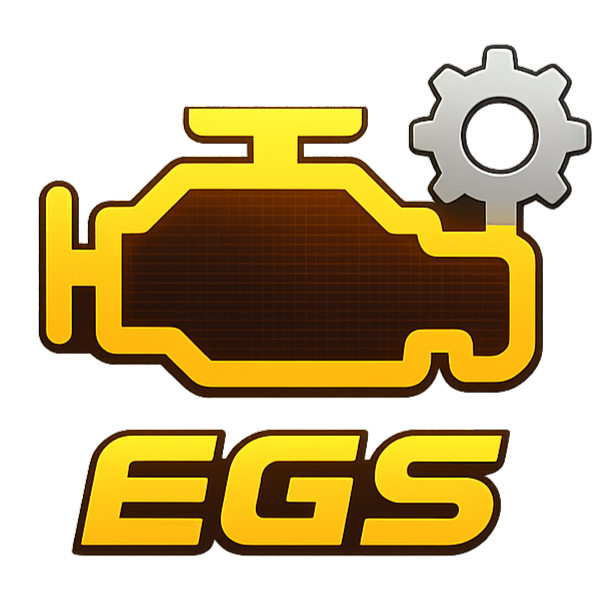

  

<h1 align="center">EG-Stat</h1>

**EG-Stat** is engine and vehicle performance calculator built in Python.

It is intended for engineers, students, and technically inclined users who want fast, explainable performance estimates.
The project emphasizes correctness, transparency, and long-term maintainability.

⚠️

Results are based on simplified physical models and assumptions, and should not replace CFD, dyno testing, or OEM-grade simulation.

---

## Purpose
EG-Stat exists to:

* Analyze internal combustion engine specifications
* Estimate engine and vehicle performance from first principles
* Explore design trade-offs under constrained inputs
* Produce results suitable for engineering discussion, validation, and iteration

EG-Stat is not a replacement for CFD, dyno testing, or OEM simulation suites.
It is a **decision-support and exploration tool**.

💡

Core physics and Mathematical equations used can be found in **CalcRef.md** file in this Repo root folder.

---

## Design Philosophy
* **Engineering-first**
  BMEP-based modeling, VE templates, and load-aware calculations

* **Transparent assumptions**
  Outputs include inferred values, warnings, and model limits

* **Library before interface**
  Core math is isolated from the CLI and future UI layers

* **Scriptable and testable**
  Designed for automation, batch analysis, and reproducibility

* **Open and extensible**
  Modular architecture intended to evolve over time

---

## Documentation & Usage

⚠️

Installation instructions, command usage, configuration details, and worked examples are **version-specific**.
Please refer to your current running version of the software to look for the correct Manual.

* Installation steps
* CLI command reference
* Usage examples
* Model assumptions and limitations
* Known issues and behavior notes

Each release is documented independently to ensure accuracy and reproducibility.

---

## Status

EG-Stat is under active development.

---

## Bug Reports & Requests

Bug reports, feature requests, and technical questions are welcome.

When reporting an issue, please include:
* EG-Stat version
* Command used
* Relevant input parameters
* Expected vs actual behavior
* More features recommendations

📧 **Contact**
**Huu Tri (Alvin) Phan**
Email: *alvinphanhuu@gmail.com*

---

## License
MIT License.
